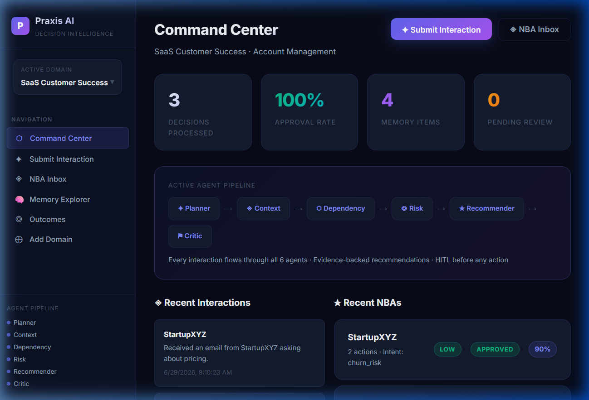
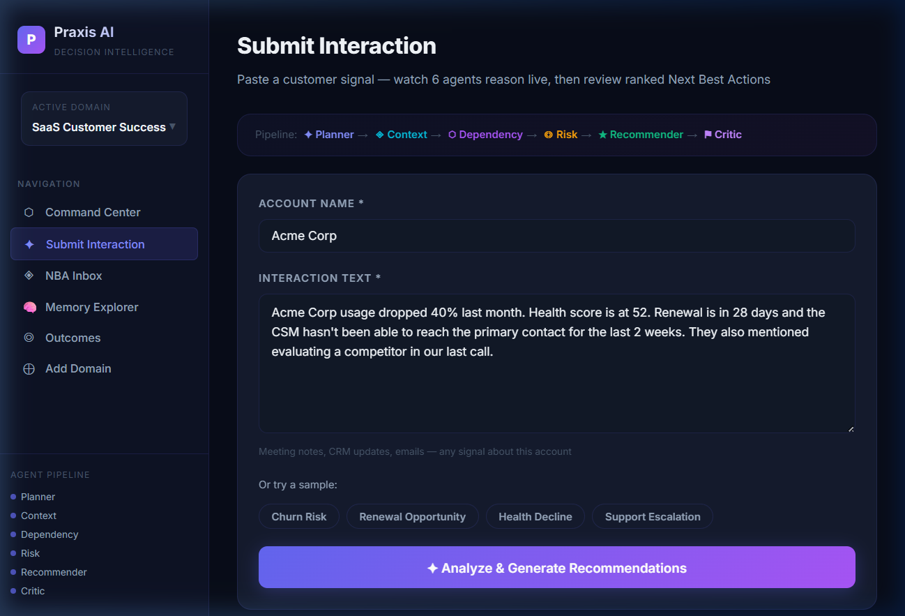
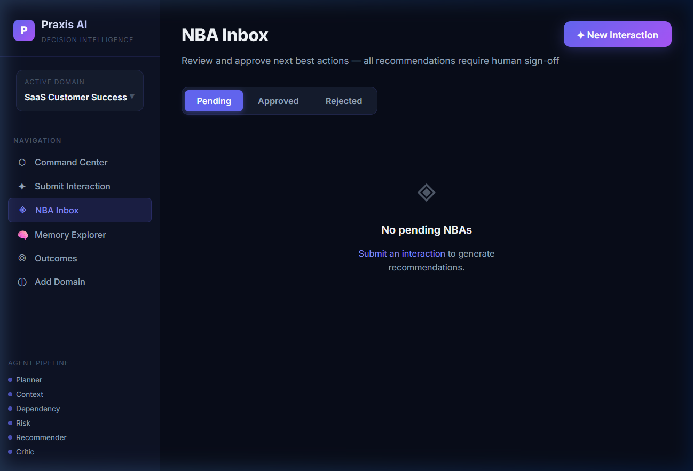
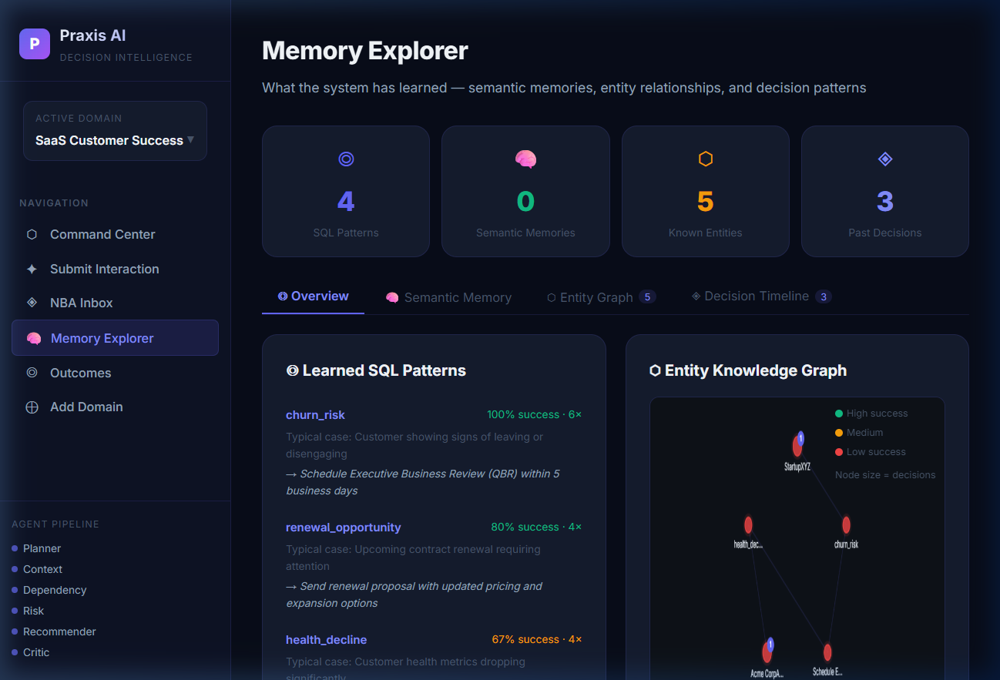
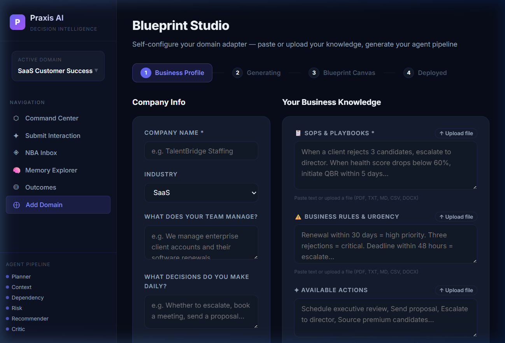

# Praxis AI — Agentic Decision Intelligence Platform

> **Turn any business signal into ranked, evidence-backed Next Best Actions — powered by a 6-agent LangGraph pipeline and 3-layer memory that learns from every human decision.**

---

## Screenshots

### Command Center


### Live Agent Pipeline — Submit Interaction


### NBA Inbox


### Memory Explorer


### Blueprint Studio — Add Your Own Domain


---

## What It Does

Praxis AI is a **B2B decision intelligence platform** for customer-facing teams. You paste in a raw business signal — a meeting note, CRM update, or email — and 6 specialized AI agents reason over it in sequence, drawing on memory of past decisions, to produce ranked Next Best Actions with confidence scores and LLM-generated reasoning.

A human reviews and approves/rejects each recommendation. That decision gets written back into a 3-layer memory system, so the platform gets smarter with every interaction.

---

## Architecture

```
┌─────────────────────────────────────────────────────────────────────────────┐
│                            PRAXIS AI PLATFORM                               │
├─────────────────────────────────────────────────────────────────────────────┤
│                                                                             │
│   USER INPUT                                                                │
│   Entity Name + Interaction Text (meeting notes, emails, CRM updates)       │
│            │                                                                │
│            ▼                                                                │
│   ┌──────────────────┐        ┌──────────────────────────────────┐          │
│   │  Domain Adapter  │        │         LLM Provider             │          │
│   │  (YAML Config)   │        │   Groq → Gemini → Ollama         │          │
│   │                  │        │         (fallback chain)          │          │
│   │  • intents.yaml  │        └──────────────────────────────────┘          │
│   │  • actions.yaml  │                       │                              │
│   │  • rules.yaml    │◄──────────────────────┘                              │
│   │  • knowledge.yaml│                                                      │
│   └────────┬─────────┘                                                      │
│            │  feeds all agents                                               │
│            ▼                                                                │
│   ╔═════════════════════════════════════════════════════════════╗            │
│   ║              LANGGRAPH AGENT PIPELINE                      ║            │
│   ║                  (SSE Streamed live to UI)                 ║            │
│   ║                                                             ║            │
│   ║  ┌──────────┐   ┌──────────┐   ┌────────────┐             ║            │
│   ║  │✦ PLANNER │──▶│◈ CONTEXT │──▶│⬡ DEPENDENCY│             ║            │
│   ║  │          │   │          │   │            │             ║            │
│   ║  │Classify  │   │Search all│   │Map entity  │             ║            │
│   ║  │intent &  │   │3 memory  │   │graph &     │             ║            │
│   ║  │entities  │   │layers    │   │relations   │             ║            │
│   ║  └──────────┘   └────┬─────┘   └─────┬──────┘             ║            │
│   ║                      │ reads          │                    ║            │
│   ║  ┌──────────┐   ┌────┴─────┐   ┌─────┴──────┐             ║            │
│   ║  │⚑ CRITIC  │◀──│★ RECOMM. │◀──│◎ RISK      │             ║            │
│   ║  │          │   │          │   │            │             ║            │
│   ║  │Reflect & │   │Rank &    │   │Score       │             ║            │
│   ║  │validate  │   │reason    │   │severity    │             ║            │
│   ║  │quality   │   │actions   │   │& urgency   │             ║            │
│   ║  └────┬─────┘   └──────────┘   └────────────┘             ║            │
│   ║       │ flags LOW_CONFIDENCE / ESCALATE                    ║            │
│   ╚═══════╪═════════════════════════════════════════════════════╝            │
│            │                                                                │
│            ▼                                                                │
│   ┌─────────────────────────────────┐                                       │
│   │    NBA (Next Best Actions)      │                                       │
│   │    Ranked · Confidence scored   │                                       │
│   │    Evidence-backed · Explained  │                                       │
│   └────────────────┬────────────────┘                                       │
│                    │                                                        │
│                    ▼                                                        │
│   ┌─────────────────────────────────┐                                       │
│   │    HUMAN-IN-THE-LOOP (HITL)     │                                       │
│   │    Approve  │  Reject + Reason  │                                       │
│   └────────────────┬────────────────┘                                       │
│                    │  writes decision back                                   │
│                    ▼                                                        │
│   ╔═════════════════════════════════════════════════╗                        │
│   ║              3-LAYER MEMORY SYSTEM              ║                        │
│   ║                                                 ║                        │
│   ║  ┌─────────────┐  ┌─────────────┐  ┌────────┐ ║                        │
│   ║  │ SQL Patterns│  │Vector Store │  │ Entity │ ║                        │
│   ║  │             │  │             │  │ Graph  │ ║                        │
│   ║  │issue→resol. │  │sentence-    │  │Network │ ║                        │
│   ║  │success rates│  │transformers │  │X / RAG │ ║                        │
│   ║  └─────────────┘  └─────────────┘  └────────┘ ║                        │
│   ╚═════════════════════════════════════════════════╝                        │
│            │  ▲                                                             │
│            └──┘  feeds back into Context agent on next request              │
└─────────────────────────────────────────────────────────────────────────────┘
```

### The 6 Agents — What Each One Does

```
✦ PLANNER      Reads intents.yaml → classifies the interaction into a known intent
               e.g. "churn_risk", "renewal_approaching", "candidate_rejection"
                    │
                    ▼
◈ CONTEXT      Queries all 3 memory layers → finds past similar cases, semantic
               matches, and entity history to build an evidence package
                    │
                    ▼
⬡ DEPENDENCY   Walks the entity graph → identifies related entities and prior
               decisions that may be impacted by this interaction
                    │
                    ▼
◎ RISK         Reads rules.yaml → deterministic keyword triggers + LLM call
               to assign severity: low / medium / high / critical
                    │
                    ▼
★ RECOMMENDER  Reads actions.yaml → filters by intent, ranks by base priority
               + memory boosts + semantic evidence, LLM generates 2-line reasoning
                    │
                    ▼
⚑ CRITIC       Reviews top recommendation → flags LOW_CONFIDENCE if evidence
               is thin, or ESCALATE if severity is critical with no clear path
```

---

## Key Features

- **Live Agent Streaming** — SSE streams each agent's output to the UI as it runs. Watch the 6-agent pipeline execute step by step with animated cards.
- **Animated Recommendations** — After pipeline completes, ranked action cards slide in with staggered animation and confidence bars that fill in real time.
- **Self-Healing Blueprint Studio** — Describe your business in plain text; the LLM generates a full YAML domain adapter. Validation errors trigger automatic re-generation (up to 3 attempts), streamed live.
- **3-Layer Memory** — SQL patterns track issue→resolution success rates. Vector store finds semantically similar past cases. Entity graph maps relationships between accounts/candidates/cases and improves context every run.
- **Rejection Learning Loop** — When a human rejects an NBA with a reason, that correction is embedded into vector memory so future recommendations improve automatically.
- **Multi-Domain Isolation** — Each company gets its own memory, adapter config, and entity graph. Switch between domains in one click.
- **Document Ingestion** — Upload PDF, DOCX, TXT, CSV, or Markdown SOPs directly into the onboarding form for knowledge extraction.
- **Memory Explorer** — Visual canvas showing the entity knowledge graph, semantic memories, SQL patterns, and full decision timeline.

---

## Tech Stack

| Layer | Technology |
|---|---|
| Frontend | Next.js 14, React 18, Vanilla CSS |
| Backend | FastAPI, Python 3.12 |
| Agent Pipeline | LangGraph 0.1, stateful directed graph |
| LLM | Groq (Llama 3) → Gemini 1.5 Flash → Ollama (fallback chain) |
| Memory — Layer 1 | SQLite + SQLAlchemy (issue→resolution patterns) |
| Memory — Layer 2 | sentence-transformers, 384-dim embeddings, cosine search |
| Memory — Layer 3 | NetworkX (entity relationship graph, GraphRAG) |
| Domain Config | Self-generated YAML adapters (intents, actions, rules, knowledge) |
| Streaming | Server-Sent Events (SSE) for both pipeline + blueprint generation |

---

## Included Domains

| Domain | Industry | Primary Entity |
|---|---|---|
| **TalentBridge** | Executive Staffing | Candidate Search |
| **Meridian SaaS** | B2B SaaS | Customer Account |
| **LexOps Legal** | Legal Services | Matter / Case |

Each comes pre-loaded with intents, actions, rules, and sample scenarios. Add your own via Blueprint Studio.

---

## Quick Start

### Prerequisites
- Python 3.12+
- Node.js 18+
- API key from [console.groq.com](https://console.groq.com) (free) **or** a Gemini API key

### 1. Clone & configure

```bash
git clone https://github.com/Asdortop/XLVentures-Hackathon-.git
cd XLVentures-Hackathon-
```

Create `backend/.env`:
```env
GROQ_API_KEY=gsk_your_key_here

# Optional fallbacks
# GEMINI_API_KEY=AIza...
# OLLAMA_BASE_URL=http://localhost:11434
```

### 2. Start the backend

```bash
cd backend
pip install -r requirements.txt
python migrate.py        # first time only — sets up the database
uvicorn main:app --reload --port 8000
```

### 3. Start the frontend

```bash
cd frontend
npm install
npm run dev
```

Open **[http://localhost:3000](http://localhost:3000)**

The app auto-seeds 3 demo domains (TalentBridge, Meridian SaaS, LexOps Legal) on first startup.

---

## Demo in 5 Steps

**1. Pick a domain** — Select **Meridian SaaS** from the sidebar domain switcher.

**2. Submit an interaction** — Go to **Submit Interaction** and click the **"Churn Risk"** sample chip. Hit **Analyze & Generate Recommendations**.

**3. Watch the pipeline** — 6 agent cards animate live as each agent processes. See the active agent pulse with a glow ring while others show checkmarks as they complete.

**4. Review recommendations** — Ranked action cards slide in with animated confidence bars. The top card has LLM reasoning explaining why it was chosen.

**5. Approve & see memory update** — Click **View Full Analysis → Approve All**. Then go to **🧠 Memory Explorer** to see the vector memories and entity graph that were just written.

---

## Project Structure

```
XLHack/
├── backend/
│   ├── agents/               # 6 LangGraph agents
│   │   ├── planner.py
│   │   ├── context.py
│   │   ├── dependency.py
│   │   ├── risk.py
│   │   ├── recommender.py
│   │   └── critic.py
│   ├── adapters/             # Domain YAML configs (per-company)
│   │   ├── talentbridge/
│   │   ├── saas_csm/
│   │   └── lexops_legal/
│   ├── core/
│   │   ├── adapter.py        # YAML loader + cache
│   │   ├── adapter_builder.py # Self-healing LLM generation
│   │   └── pipeline.py       # LangGraph state machine
│   ├── memory/
│   │   ├── vector_store.py   # Neural embeddings + cosine search
│   │   └── entity_graph.py   # NetworkX GraphRAG
│   ├── routes/               # FastAPI route handlers
│   ├── database.py           # SQLAlchemy models
│   ├── llm_provider.py       # Multi-provider fallback chain
│   └── main.py
│
└── frontend/
    └── app/
        ├── page.tsx           # Command Center dashboard
        ├── interact/          # Submit Interaction (SSE streaming)
        ├── nba/               # NBA Inbox + Detail + HITL
        ├── memory/            # Memory Explorer
        ├── outcomes/          # Business Outcomes dashboard
        └── onboarding/        # Blueprint Studio
```

---

## Environment Variables

```env
# backend/.env

# LLM — at least one required (Groq is fastest, recommended)
GROQ_API_KEY=gsk_...
GEMINI_API_KEY=AIza...          # optional fallback
OLLAMA_BASE_URL=http://localhost:11434  # optional local fallback

# Production only
CORS_ORIGINS=https://your-app.vercel.app,http://localhost:3000
```
